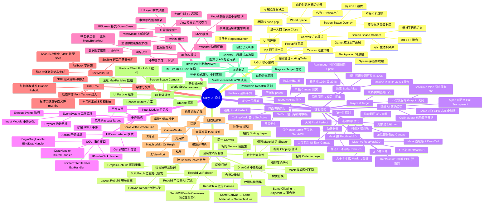

# 【笔记】UI系统知识脑图

> 将知识库中分散在 20+ 篇 UI 文档中的知识点，组织成一棵完整的知识树。用于快速定位、查漏补缺、面试复习。

## Mermaid 脑图

> 在 Obsidian 中渲染为可视化脑图。不支持 Mermaid mindmap 的环境下请看下方文字版。



---

## 文字版知识树

### 1. UGUI 核心架构

```
UGUI 核心架构
├── Canvas 渲染模式
│   ├── Screen Space - Overlay
│   │   ├── 覆盖在场景最上层，不受相机影响
│   │   ├── 合批最优（单 Canvas 全合批）
│   │   └── 适用：纯 2D UI 游戏、HUD、固定 UI
│   │
│   ├── Screen Space - Camera
│   │   ├── 相对于相机渲染，可设距离产生透视
│   │   ├── 支持 3D + UI 混合、后期处理
│   │   └── 适用：3D 游戏的主 UI 层
│   │
│   └── World Space
│       ├── 作为 3D 物体存在于场景中
│       ├── 可被遮挡、有深度
│       ├── 合批最差（每 Canvas 独立 Batch）
│       └── 适用：血条、对话框、物品标签
│
├── Canvas 分层策略
│   ├── Layer_Background (0)    背景装饰
│   ├── Layer_Game (100)        游戏主界面 HUD
│   ├── Layer_Popup (200)       弹窗
│   ├── Layer_Top (300)         顶层提示 Toast
│   └── Layer_System (400)      加载/网络/系统
│
└── UI 管理器设计
    ├── UIScreen 基类：Open(param) / Close() / IsOpen
    ├── UILayer 枚举：sortingOrder 控制层深
    ├── Dictionary<string, UIScreen> 注册制
    ├── Stack<UIScreen> 界面栈：Back() 返回上一级
    └── CloseAll() 全关闭
```

> 真相层：[[【教程】UI系统架构]]

---

### 2. 渲染管线与合批

```
渲染管线与合批
├── 渲染流程三阶段
│   ├── ① Layout Rebuild → 重新计算 UI 元素位置和大小
│   ├── ② Graphic Rebuild → 重新生成 UI 顶点数据（Vertex）
│   └── ③ Canvas Render → 根据 Material 和批次信息合批渲染
│
├── Rebuild vs Rebatch（关键区分）
│   ├── Rebuild
│   │   ├── 单位：UI 元素（单个 Graphic）
│   │   ├── 触发：顶点属性变化（Color / Size / Text 内容）
│   │   ├── Profiler：Canvas.SendWillRenderCanvases
│   │   └── 无法从 Profiler 直接看出是哪个元素（排查难点）
│   │
│   └── Rebatch
│       ├── 单位：Canvas（整个画布）
│       ├── 触发：Canvas 内任意元素变化（含位置）
│       ├── Profiler：Canvas.BuildBatch + 子线程 SortJob/GeometryJob
│       └── Profiler 可看出哪个 Canvas 在 Rebatch
│
├── 合批七大条件（必须同时满足）
│   ├── 1. 同一个 Canvas
│   ├── 2. 相同的 Material（包括 Shader）
│   ├── 3. 相同的 Texture（或图集）
│   ├── 4. 相邻的渲染队列（层级中相邻）
│   ├── 5. 相同的 Clipping 区域
│   ├── 6. 相同的 Sorting Layer
│   └── 7. 相同的 Order in Layer
│
├── 合批决策树
│   │
│   └── CanBatch(A, B)?
│       ├── Same Canvas? → NO → ✗
│       ├── Same Material? → NO → ✗
│       ├── Same Texture? → NO → ✗
│       ├── Same Clipping? → NO → ✗
│       ├── Adjacent in Hierarchy? → NO → ✗
│       └── 全 YES → ✓ 可以合批
│
└── DrawCall 中断常见原因
    ├── 材质切换（不同 Shader / Material 实例）
    ├── 纹理切换（不同图集 / 独立 Sprite）
    ├── Mask 裁剪区域不同
    ├── 层级中穿插了不同材质的元素
    └── 移到屏幕外不会减少 DrawCall（仍参与合批网格）
```

> 真相层：[[【设计原理】UGUI合批机制深度解析]] · 量化数据：[[【笔记】UGUI DrawCall影响因素全面测试]]

---

### 3. 性能优化

```
性能优化
├── 图集（SpriteAtlas）
│   ├── 打包原则
│   │   ├── 同一界面使用的图片放同一图集
│   │   ├── 公共依赖单独成包避免冗余
│   │   └── 零碎小资源合并
│   │
│   ├── Include in Build 与 AB 冗余规则
│   │   ├── SpriteAtlas 不打 AB → 必须勾 Include in Build
│   │   ├── SpriteAtlas 打进 AB → sactx 不冗余
│   │   └── 勾不勾不影响依赖关系，只影响是否主动显示
│   │
│   ├── RawImage 陷阱
│   │   ├── RawImage 不能引用图集中的 Sprite（否则重复打包）
│   │   └── 一定要引用则不要打入图集
│   │
│   └── 尺寸策略
│       ├── 常驻通用资源：可放宽 2048~4096
│       ├── 功能独有图集：控制在 1024 以内
│       └── 3 张 1024 级别才考虑升 2048
│
├── 动静分离（第一性原则）
│   ├── 原理：Rebatch 以 Canvas 为单位
│   ├── 做法：高频变动 UI 与静态 UI 分到不同 Canvas
│   ├── 效果：动态 Canvas 重建不影响静态 Canvas
│   ├── 限制：只优化 BuildBatch，不优化 SendWillRenderCanvases
│   └── 非静态 Canvas 严格控制元素数量
│
├── Mask vs RectMask2D
│   ├── RectMask2D
│   │   ├── 不依赖 Image，裁剪区域 = 自身 RectTransform
│   │   ├── 孩子不能与外界合批，多个 RectMask2D 间不能合批
│   │   ├── 持续开销：每帧计算子节点裁剪区域
│   │   └── 适合：单个裁剪区域
│   │
│   ├── Mask
│   │   ├── 依赖 Image 组件，裁剪区域 = Image 大小
│   │   ├── 首尾各多 2 个 DrawCall
│   │   ├── 多个 Mask 间符合条件可合批（首首合，尾尾合）
│   │   ├── Mask 内外不能合批，但多个 Mask 内可以
│   │   └── 适合：大于 2 个裁剪区域
│   │
│   └── 数量决策
│       ├── 1 个 → RectMask2D
│       ├── 2 个 → 差不多
│       └── > 2 个 → Mask（Mask 间可合批）
│
├── 滚动列表优化
│   ├── 滚动部分独立 Canvas（缩小 BuildBatch 范围）
│   ├── 拖动时关闭 Pixel Perfect
│   ├── Mask → RectMask2D（结合数量决策）
│   ├── 对象池复用 Item
│   ├── 可视区域剔除（SetActive 屏幕外元素）
│   └── 拖动翻页（一次只移动两页元素）
│
├── 隐藏 UI 的正确姿势
│   ├── SetActive(false) → 彻底但有 GC + Instantiate/Destroy 开销
│   ├── CullingMask 软隐藏 → 切换零开销、无多余 DrawCall
│   ├── Scale = 0 → 降 CPU 但仍参与 Rebuild 排序
│   ├── Alpha = 0 + Cull Transparent → DrawCall 和顶点更少
│   └── 禁忌：OnEnable/OnDisable 内不写重要逻辑（产生大量 GC）
│
├── TextMeshPro 优化
│   ├── SetText("{0}", score) 替代字符串拼接（避免 GC）
│   ├── 减少字号种类（字号种类越多纹理越大）
│   ├── 静态字体方案（避免动态字体 SendWillRenderCanvases 耗时）
│   ├── 单独 Canvas 隔离高频更新 TMP
│   └── Fallback 遍历序列：主字体 → 后备 → 通用后备 → 默认
│
├── 界面切换优化
│   ├── 预实例化（避免运行时 Instantiate 229ms）
│   ├── 不修改 parent（避免 TransformChanged 回调）
│   ├── 避免 Pixel Perfect
│   ├── CullingMask 替代 SetActive 做软隐藏
│   └── 禁忌：不要在 OnEnable/OnDisable 里写重要逻辑
│
└── Raycast Target 优化
    ├── 不需交互的 Graphic 关闭 Raycast Target
    ├── 减少事件检测开销
    └── 递归批量设置
```

> 综述：[[【笔记】UGUI性能优化实战总览]] · 图集深度解析：[[【笔记】UGUI图集机制深度解析]] · 规则清单：[[【片段】UGUI 性能优化规则清单]] · 速查：[[【最佳实践】UI性能优化速查]]

---

### 4. 事件系统

```
事件系统
├── UGUI 事件接口
│   ├── IPointerClickHandler      点击
│   ├── IPointerEnterHandler      鼠标/手指进入
│   ├── IPointerExitHandler       鼠标/手指离开
│   ├── IDragHandler              拖拽
│   ├── IBeginDragHandler         开始拖拽
│   ├── IEndDragHandler           结束拖拽
│   ├── IScrollHandler            滚轮
│   ├── IPointerDownHandler       按下
│   └── IPointerUpHandler         抬起
│
├── EventSystem 工作原理
│   ├── ① Raycast 拾取：GraphicRaycaster 向场景发射射线
│   ├── ② Input Module 事件分发：StandaloneInputModule 处理输入
│   └── ③ ExecuteEvents.Execute<T> 在目标上执行事件接口
│
├── UIEventListener 模式
│   ├── 扩展 UGUI 事件为 C# Action 回调
│   ├── Get(GameObject) 静态工厂方法（自动 AddComponent）
│   └── 解耦：业务代码注册回调而非实现接口
│
└── 事件穿透
    ├── Raycast Target = false 的 Graphic 不参与拾取
    ├── 自定义 Input Module 控制事件分发逻辑
    └── Canvas 组件可整体排除事件检测
```

> 真相层：[[【笔记】Unity事件系统实现机制]] · 架构决策：[[【架构决策】事件系统实现对比]]

---

### 5. UI 架构模式

```
UI 架构模式
├── MVP 模式（推荐）
│   ├── Model
│   │   ├── 纯数据模型，不依赖 UI
│   │   ├── 事件通知：OnItemAdded / OnChanged
│   │   └── 可独立测试
│   │
│   ├── View
│   │   ├── 负责 UI 显示和用户交互
│   │   ├── 暴露事件：OnSlotClicked / OnCloseClicked
│   │   ├── 不含业务逻辑
│   │   └── 继承 UIScreen 基类
│   │
│   ├── Presenter
│   │   ├── 协调 View 和 Model
│   │   ├── 绑定/解绑事件（生命周期管理）
│   │   ├── 处理用户交互逻辑
│   │   └── Dispose() 清理
│   │
│   └── 数据流：View ←→ Presenter ←→ Model
│
├── MVVM 模式
│   ├── ViewModel 双向绑定
│   ├── 数据驱动 UI 自动更新
│   ├── 适合数据密集型界面（背包、商店、装备）
│   └── 需要绑定框架支持
│
├── 架构决策
│   ├── UI 复杂度低 → 直接 MonoBehaviour + GetComponent
│   ├── 中等复杂度 → MVP
│   ├── 数据绑定密集 → MVVM
│   └── 决策矩阵：[[【架构决策】UI架构-MVP vs MVVM]]
│
└── 设计要点
    ├── View 只管显示，不管为什么显示
    ├── Model 不引用 UnityEngine.UI
    ├── Presenter 负责所有 if/else 逻辑
    └── 事件绑定在 OnEnable，解绑在 OnDisable
```

> 真相层：[[【教程】UI系统架构]] · 架构决策：[[【架构决策】UI架构-MVP vs MVVM]]

---

### 6. 字体与文本

```
字体与文本
├── UGUI Text（原生）
│   ├── 动态字体机制
│   │   ├── 按需渲染字符到 Font Texture
│   │   ├── 字号种类越多纹理越大
│   │   └── 不同字号 = 不同纹理区域
│   │
│   ├── 粗体陷阱
│   │   ├── Unity 做的是伪粗（算法加粗）
│   │   └── 真粗体需要独立字面文件（msyh + msyhbd）
│   │
│   └── 性能问题
│       ├── 每帧修改 text 触发 Graphic Rebuild（500+/帧）
│       ├── Font.CacheFontForText 耗时
│       └── 解决：限制更新频率（10Hz）
│
└── TextMeshPro
    ├── SDF 渲染
    │   ├── 基于签名距离场，任意缩放保持清晰
    │   ├── 支持 描边/阴影/发光 等 Shader 特效
    │   └── 一套字体 Atlas 适配所有字号
    │
    ├── 性能优化
    │   ├── SetText("{0}", value) 避免字符串拼接 GC
    │   ├── 静态字体方案（预生成 Atlas）
    │   ├── 单独 Canvas 隔离高频 TMP
    │   └── ForceMeshUpdate 控制重建时机
    │
    ├── Fallback 字体链
    │   └── 主字体 → 后备 → 通用后备 → 默认
    │
    └── Atlas 内存优化
        ├── 从 64MB 降至 5MB 的实战案例
        └── 多语言/多字体 Atlas 独立管理
```

> TMP 专项：[[【最佳实践】TextMeshPro性能优化实战]] · 字体 Atlas 优化实战（UWA 外部参考）

---

### 7. 适配

```
适配
├── CanvasScaler
│   ├── Scale With Screen Size（最常用）
│   │   ├── 参考分辨率 Reference Resolution
│   │   ├── Match Width Or Height（0~1 权重）
│   │   └── Shrink/Snap 补充模式
│   │
│   ├── Constant Pixel Size
│   │   └── 固定像素，手动算 scaleFactor
│   │
│   └── Constant Physical Size
│       └── 按 DPI 缩放
│
├── 刘海屏适配
│   ├── 方案1：改相机 ViewPort Rect
│   ├── 方案2：缩放 UI 根节点
│   └── 方案3：改锚点避开安全区
│
├── 横竖屏切换
│   ├── 修改 Screen.orientation
│   ├── 切换 CanvasScaler 参数
│   │   ├── 竖屏：(1080, 1920), match = 0
│   │   └── 横屏：(1920, 1080), match = 1
│   └── 全屏遮罩 fade 过渡
│
└── 自适应背景
    ├── CPU：拉伸（变形）vs 裁切
    └── GPU：修改采样矩阵填充
```

> **深度解析**：[[【笔记】UGUI自适应机制深度解析]] — CanvasScaler Match 公式推导、Anchor 计算原理、SafeArea 代码、横竖屏切换、自适应背景完整实现

---

### 8. UI 特效混合

```
UI 特效混合（UI 中夹 Particle / Mesh）
├── Particle Effect For UGUI 插件
│   └── 原生 ParticleSystem 渲染到 Canvas
├── UIEffect 插件
│   └── Shader 级 UI 特效（描边/阴影/灰度/扭曲）
├── UI Particle 组件
│   ├── 让 UI 中间显示粒子
│   └── ⚠️ 注意 MaxParticles 数量（按此初始化数组）
├── Render Texture 方案
│   └── 摄像机渲染到 RT，UI 显示 RT
├── World Space Canvas
│   └── 粒子与 UI 在同一 3D 空间
├── Screen Space - Camera
│   └── 调整相机深度排序
└── 多相机分层
    └── 各层独立相机，TargetTexture 合成
```

> 文档：[[【笔记】UI粒子特效实现方案]]

---

### 9. 面试自测 Checklist

```
面试自查（出门前逐条确认）
├── [ ] 能说出 Canvas 三种渲染模式及选型依据
├── [ ] 能背出合批七大条件
├── [ ] 能区分 Rebuild 与 Rebatch（单位、触发、Profiler 标记）
├── [ ] 能解释动静分离为什么是第一性原则
├── [ ] 能说出 Mask vs RectMask2D 的数量决策（1/2/>2）
├── [ ] 能讲清图集 Include in Build 与 AB 打包的冗余规则
├── [ ] 知道 RawImage 不能引用图集中的 Sprite
├── [ ] 能说出隐藏 UI 的 4 种方式及各自优劣
├── [ ] 能解释为什么移到屏幕外不能减少 DrawCall
├── [ ] 知道 Raycast Target 关闭的优化原理
├── [ ] 能说出 TMP vs UGUI Text 的核心差异（SDF / GC / Rebuild）
├── [ ] 能画出 MVP 三层结构与数据流
├── [ ] 知道 EventSystem 的 Raycast → Input Module → Execute 流程
├── [ ] 能说出滚动列表优化的 5 个手段
└── [ ] 能讲自己真实项目的 UI 架构选型理由（不背标准答案）
```

> 面试问答：[[【笔记】性能优化面试问答]]（含 UI 性能部分）

---

## 文档关系图

```
                【教程】UI系统架构
                （架构设计 · 管理器 · MVP）
                       │
          ╱────────────┼────────────╲
         ╱              │              ╲
  【设计原理】      【笔记】         【踩坑】
  UGUI合批机制     UGUI性能优化     UGUI常见性能
  深度解析          实战总览         陷阱与根因
  (Rebuild/Rebatch  (综述 · 速查)    分析
   合批决策树)            │              │
         │               │              │
         │          【笔记】            │
         │          DrawCall影响        │
         │          因素全面测试        │
         │               │              │
         ╲───────────────┼──────────────╱
                    【笔记】UI系统知识脑图
                    （本文 · 全景脑图）
                         │
          ╱───────────────┼───────────────╲
         ╱                 │                 ╲
  【最佳实践】       【实战案例】        【片段】
  UI性能优化速查     UI卡顿优化全流程    UGUI性能优化
  TMP优化实战                          规则清单
         │
  【笔记】Unity事件系统实现机制
  【笔记】UI粒子特效实现方案
  【架构决策】UI架构-MVP vs MVVM
  UI系统专题索引
```

---

## 相关文档

| 文档 | 定位 | 覆盖脑图分支 |
|------|------|-------------|
| [[【教程】UI系统架构]] | 架构设计 · 管理器 · MVP | 1 核心架构 + 5 架构模式 |
| [[【设计原理】UGUI合批机制深度解析]] | 渲染管线 · 合批底层 · 源码 | 2 渲染管线与合批 |
| [[【笔记】UGUI性能优化实战总览]] | 综述 · 全景优化速查 | 3 性能优化 |
| [[【笔记】UGUI DrawCall影响因素全面测试]] | DrawCall 量化数据 | 2 渲染管线与合批 |
| [[【踩坑】UGUI常见性能陷阱与根因分析]] | 陷阱 · 根因 · SendWill 风暴 | 3 性能优化 |
| [[【最佳实践】UI性能优化速查]] | 按 ROI 排序的优化速查 | 3 性能优化 |
| [[【最佳实践】TextMeshPro性能优化实战]] | TMP 字体专项优化 | 6 字体与文本 |
| [[【实战案例】UI卡顿优化全流程]] | 30fps → 60fps 全流程 | 3 性能优化 |
| [[【片段】UGUI 性能优化规则清单]] | Code Review 规则 R1-R6 | 3 性能优化 |
| [[【笔记】Unity事件系统实现机制]] | EventSystem 底层机制 | 4 事件系统 |
| [[【笔记】UI粒子特效实现方案]] | UI + 特效混合方案 | 8 UI 特效混合 |
| [[【架构决策】UI架构-MVP vs MVVM]] | 架构选型决策 | 5 架构模式 |
| [[【笔记】UGUI自适应机制深度解析]] | CanvasScaler 原理 · Anchor · SafeArea | 7 适配 |
| [[【笔记】UGUI图集机制深度解析]] | SpriteAtlas 原理 · sactx 冗余 · 动态图集 · TMP Atlas | 3 性能优化 |
| [[UI系统专题索引]] | UI 系统文档导航 | 全部 |
