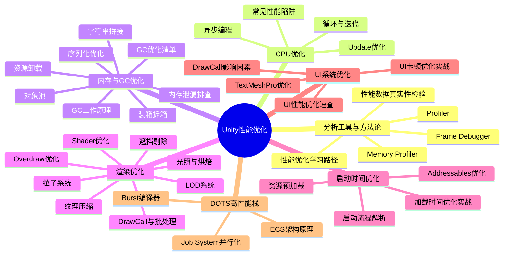

# 性能优化专题脑图

> 涵盖 54 篇文档，按 **分析工具 → CPU → 内存 → 渲染 → 启动 → UI → DOTS** 七大维度组织。

## Mermaid 可视化



## 文字版完整脑图

### 1. 分析工具与方法论

```
分析工具与方法论
├── Profiler（CPU/GPU/内存性能分析）
│   ├── 【教程】性能分析工具
│   └── 【教程】性能优化学习路径
├── Frame Debugger（渲染诊断）
│   └── 【教程】Frame Debugger渲染诊断流程
├── Memory Profiler（内存快照对比）
│   └── 【最佳实践】内存分析工具使用指南
├── 性能数据验证
│   └── 【笔记】性能数据真实性检验
└── 发热问题定位
    └── 【笔记】手机游戏发热性能问题定位与优化
```

### 2. CPU 优化

```
CPU 优化
├── Update 帧循环优化
│   ├── 【最佳实践】Update优化清单
│   │   ├── 避免 GC 分配
│   │   ├── 缓存组件引用
│   │   ├── 协程替代 FixedUpdate
│   │   └── 逻辑分层（固定频率 vs 每帧）
│   └── 【教程】CPU优化技术
├── 循环与迭代
│   ├── 【设计原理】为什么 foreach 比 for 慢
│   │   ├── 枚举器装箱
│   │   ├── 接口调用开销
│   │   └── GC 分配
│   ├── 【笔记】foreach vs for（性能测试数据）
│   ├── 【笔记】LINQ性能测试（LINQ vs 手写循环）
│   └── 【笔记】Dictionary性能（基准测试）
├── 异步编程
│   ├── 【最佳实践】异步编程最佳实践
│   │   ├── 协程（Coroutine）
│   │   ├── UniTask（零GC异步）
│   │   └── Task / async-await
│   └── 【笔记】协程vs UniTask（性能对比）
└── 常见陷阱
    └── 【踩坑】常见性能陷阱
        ├── 空 Update 开销
        ├── Camera.main 每帧查找
        ├── GetComponent 频繁调用
        └── LINQ 隐式分配
```

### 3. 内存与 GC 优化

```
内存与 GC 优化
├── GC 原理
│   └── 【设计原理】GC工作原理深度解析
│       ├── 代际机制（Gen0/Gen1/Gen2）
│       ├── 触发条件
│       ├── 堆碎片化
│       └── GC 分配预算
├── GC 优化策略
│   └── 【最佳实践】GC优化清单
│       ├── 避免热路径分配
│       ├── 对象池复用
│       ├── 预分配容器
│       └── 值类型替代引用类型
├── 内存泄漏
│   ├── 【踩坑】内存泄漏模式（常见模式）
│   ├── 【实战案例】内存泄漏排查实战（480MB→120MB）
│   │   └── Memory Profiler 快照对比法
│   └── 【设计原理】Unity内存管理（原生/托管/资源）
├── 资源卸载
│   ├── 【最佳实践】资源卸载指南
│   │   ├── AssetBundle.Unload
│   │   ├── Resources.UnloadUnusedAssets
│   │   ├── 纹理/音频释放策略
│   │   └── 场景切换清理
│   └── 【最佳实践】序列化性能优化
│       ├── JsonUtility vs Newtonsoft
│       └── 二进制序列化对比
├── 微优化（热点分配）
│   ├── 【笔记】装箱拆箱性能影响
│   │   └── int→object 的 28x 开销
│   ├── 【笔记】字符串拼接方式对比
│   │   ├── StringBuilder vs + vs Concat
│   │   └── 零分配字符串技术
│   └── 【笔记】对象池vs实例化
│       └── 实例化 1000 次的性能差距
└── 对象池（跨目录）
    ├── 【设计原理】对象池本质（架构设计）
    ├── 【教程】对象池模式（架构设计）
    └── 【代码片段】对象池通用实现（架构设计）
```

### 4. 渲染优化

```
渲染优化
├── DrawCall 与批处理
│   ├── 【最佳实践】3D渲染优化指南
│   │   ├── 静态批处理（Static Batching）
│   │   ├── 动态批处理（Dynamic Batching）
│   │   ├── SRP Batcher（URP/HDRP）
│   │   ├── GPU Instancing
│   │   └── 材质合并策略
│   └── 【教程】渲染性能优化
├── LOD 系统
│   └── 【最佳实践】LOD系统实战指南
│       ├── LOD 级别配置
│       ├── LOD 过渡优化（抖动消除）
│       └── 性能收益量化
├── 遮挡剔除
│   └── 【最佳实践】遮挡剔除实战
│       ├── Occlusion Area 配置
│       ├── 烘焙参数调优
│       └── 效果验证
├── Overdraw 优化
│   └── 【最佳实践】Overdraw优化实战
│       ├── 检测方法（Scene View Overdraw）
│       ├── 透明物体排序
│       └── 几何简化
├── 光照与烘焙
│   └── 【最佳实践】光照与烘焙优化
│       ├── Lightmap 优化
│       ├── 实时光照策略
│       ├── Shadow 分辨率/距离
│       └── 移动平台光照降级
├── Shader 优化
│   └── 【笔记】Shader性能优化
│       ├── 指令数对比
│       ├── 数学运算复杂度
│       ├── 移动端 Shader 分支
│       └── 变体控制
├── 粒子系统
│   └── 【最佳实践】粒子系统优化
│       ├── 粒子数量控制
│       ├── 碰撞优化
│       ├── GPU Events
│       └── 纹理图集
└── 纹理压缩
    └── 【笔记】纹理压缩格式对比
        ├── ASTC（推荐移动端）
        ├── BC7（PC/主机）
        ├── ETC2（Android 兼容）
        ├── 大小/质量/加载时间
        └── 平台支持矩阵
```

### 5. 启动时间优化

```
启动时间优化
├── 启动流程分析
│   └── 【设计原理】Unity启动流程深度解析
│       ├── Splash Screen 阶段
│       ├── 脚本初始化
│       ├── 首场景加载
│       └── 首帧渲染
├── Addressables 优化
│   └── 【最佳实践】Addressables性能优化
│       ├── 异步加载策略
│       ├── AssetBundle 大小控制
│       ├── 依赖预加载
│       └── 内存释放时机
├── 资源预加载
│   └── 【最佳实践】资源预加载策略
│       ├── 同步 vs 异步加载
│       ├── 分阶段加载
│       ├── 后台预加载
│       └── 优先级队列
├── 效果量化
│   └── 【笔记】优化措施效果对比
│       ├── 异步加载收益
│       ├── 资源压缩收益
│       └── 场景精简收益
└── 实战案例
    └── 【实战案例】加载时间优化实战（8.5s→1.2s，20s→5s）
        ├── Addressables 迁移
        ├── 资源压缩
        └── 踩坑经验
```

### 6. UI 系统优化（跨目录）

```
UI 系统优化
├── DrawCall 优化
│   └── 【笔记】UGUI DrawCall影响因素全面测试
│       ├── 图集对 DrawCall 的影响
│       ├── 层级穿插
│       ├── 材质/纹理切换
│       └── Canvas 拆分策略
├── UI 性能速查
│   └── 【最佳实践】UI性能优化速查
│       ├── Canvas 分层（静态/动态分离）
│       ├── Rebuild/Relayout 控制
│       ├── 图文分离
│       └── Overdraw 控制
├── TextMeshPro
│   └── 【最佳实践】TextMeshPro性能优化实战
│       ├── 字体图集大小
│       ├── SDF 渲染开销
│       └── 动态字体管理
└── 实战案例
    └── 【实战案例】UI卡顿优化全流程（30fps→60fps）
        ├── 问题发现→定位→解决→量化
        ├── Rebuild 热点排查
        └── Canvas 重建优化
```

### 7. DOTS 高性能技术栈（跨目录）

```
DOTS 高性能技术栈
├── ECS 架构
│   └── 【设计原理】ECS为什么快
│       ├── 内存布局（Struct 连续存储）
│       ├── 缓存命中率
│       ├── SIMD 友好
│       └── 多线程友好
├── Burst 编译器
│   └── 【教程】Burst编译器
│       ├── LLVM 后端
│       ├── SIMD 自动向量化
│       ├── 数学库（Unity.Mathematics）
│       └── NoAlias 优化提示
└── Job System
    └── 【教程】JobSystem详解
        ├── IJobParallelFor
        ├── 多线程安全（NativeContainer）
        ├── Job 依赖调度
        └── 与主线程协作
```

## 快速导航：按问题类型查文档

| 症状 | 可能原因 | 首选文档 |
|------|---------|---------|
| 游戏卡顿掉帧 | GC spike / Update 重逻辑 | GC优化清单 → Update优化清单 → CPU优化技术 |
| 渲染瓶颈 | DrawCall 过多 / Overdraw | Frame Debugger流程 → 3D渲染优化指南 |
| 内存持续增长 | 内存泄漏 | 内存分析工具指南 → 内存泄漏排查实战 |
| 启动慢 | 资源加载阻塞 | 启动流程深度解析 → 加载时间优化实战 |
| UI 卡顿 | Canvas Rebuild | UI性能优化速查 → UI卡顿优化全流程 |
| 手机发热 | GPU 负载 / 频率锁 | 手机游戏发热性能问题定位与优化 |
| 数据异常 | 怀疑测试结论 | 性能数据真实性检验 |

## 相关链接

- [[性能优化专题索引]] — 完整文档索引（按类型/目录）
- [[【教程】性能优化学习路径]] — 系统化学习路线
- [[../00_元数据与模板/学习路径导航]] — 全局导航
