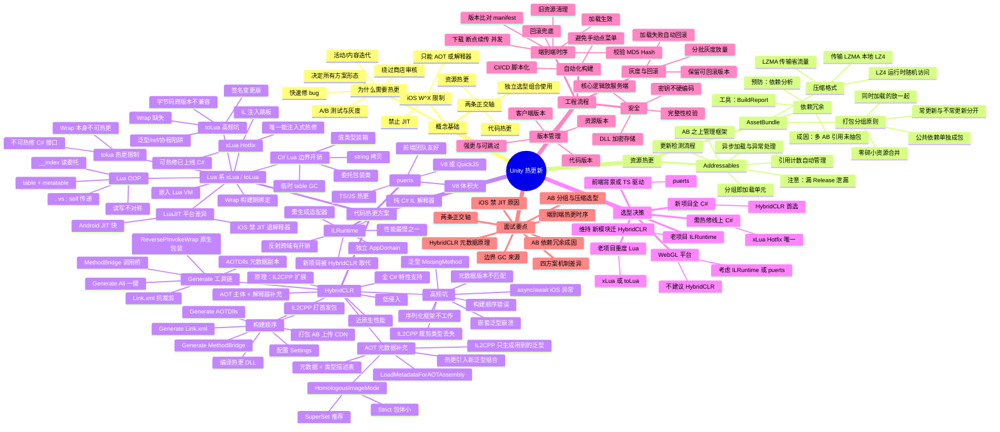

# 【笔记】热更新知识脑图

> 将知识库中分散在 10+ 篇热更文档中的知识点，组织成一棵完整的知识树。用于快速定位、查漏补缺、面试复习。

## Mermaid 脑图

> 在 Obsidian 中渲染为可视化脑图。不支持 Mermaid mindmap 的环境下请看下方文字版。



---

## 文字版知识树

### 1. 概念基础

```
热更新
├── 为什么需要
│   ├── 绕过商店审核（苹果审核数天~数周，可能拒审）
│   ├── 快速修 bug（线上崩溃几小时内修复）
│   ├── 活动/内容迭代（节日活动、新关卡等不及审核）
│   └── A/B 测试与灰度运营
│
├── iOS W^X 限制（根因）
│   ├── W^X = Writable XOR Execute 内存保护
│   ├── 一块内存「可写」就「不可执行」
│   ├── 禁止 JIT（JIT 需写可执行内存）
│   ├── 推论：iOS 代码只能 ① AOT 预编译 ② 解释器跑字节码
│   └── Android 理论上可 JIT，但工程上统一走 IL2CPP
│
└── 两条正交轴（核心心智模型）
    ├── 资源热更：贴图/模型/配置/音频 → AssetBundle / Addressables
    ├── 代码热更：C# 逻辑 → HybridCLR / ILRuntime / Lua / puerts
    └── 一套完整热更 = 资源热更 + 代码热更（独立选型）
```

> 真相层：[[【设计原理】热更新方案对比]] §二-三

---

### 2. 资源热更

```
资源热更
├── AssetBundle
│   ├── 打包分组原则
│   │   ├── 常更新与不常更新分开（减小热更包体积）
│   │   ├── 需同时加载的资源放一起（提高加载效率）
│   │   ├── 公共依赖单独成包（避免冗余打包）
│   │   └── 同时加载的零碎小资源合并
│   │
│   ├── 压缩格式
│   │   ├── LZMA：压缩率最高，流式压缩（读任意资源需整包解压）
│   │   │   └── 适合首包/整包下发（省流量）
│   │   ├── LZ4/LZ4HC：块压缩，支持分块随机访问（seek），解压快
│   │   │   └── 适合热更/运行时按需加载
│   │   └── 最佳实践：CDN 传 LZMA → 本地缓存解为 LZ4 → 运行时 LoadFromFile
│   │
│   ├── 依赖冗余
│   │   ├── 成因：一个资源被多 AB 引用且未单独抽包 → 分别打进每个 AB
│   │   ├── 发现工具：AssetBundle Analyzer / BuildReport / GetDependencies
│   │   └── 预防：依赖分析 + 合理分组
│   │
│   └── 文档：[[【笔记】Unity资源依赖与打包陷阱]]
│
└── Addressables
    ├── 定位：AB 之上的管理框架（自动处理依赖图、引用计数、异步加载）
    ├── 引用计数：Load +1 / Release -1，归零才卸载
    │   ├── 漏 Release → 内存泄漏
    │   └── 多 Release → 崩溃
    ├── 分组即加载单元：同组资源一起进内存
    ├── 异步句柄：注意完成时机与异常，避免 .Result 同步阻塞
    ├── 更新检测流程：InitializeAsync → CheckForCatalogUpdates → DownloadDependencies
    └── 文档：[[【教程】打包与热更新]] §1
```

---

### 3. 代码热更方案对比

```
代码热更方案
├── HybridCLR ← 新项目首选
│   ├── 执行机制：IL2CPP 的扩展（AOT 主体 + 解释器模块）
│   ├── 性能：近原生（最快）
│   ├── C# 特性完整度：高（泛型、反射、async 几乎全支持）
│   ├── 侵入性：低（同语言、无脚本层）
│   ├── 代价：构建管线复杂 + 泛型需补 AOT 元数据
│   │
│   ├── AOT 元数据补充（核心机制）
│   │   ├── 元数据 = 程序集的"目录+索引"（TypeDef/MethodDef/FieldDef 等）
│   │   ├── IL2CPP 只生成首发包"用到的"泛型组合
│   │   ├── 热更代码引入新泛型 → 解释器需要类型布局信息
│   │   ├── 解法：构建期提取 AOT 元数据副本 → 运行时加载
│   │   ├── 代码：LoadMetadataForAOTAssembly(dllBytes, HomologousImageMode.SuperSet)
│   │   ├── 必须补充：mscorlib / System / System.Core / UnityEngine.CoreModule ...
│   │   └── 不补充 → MissingMethodException: AOT generic type not instantiated
│   │
│   ├── Generate 工具链
│   │   ├── Link.xml → 对抗 IL2CPP 代码裁剪（保留反射/序列化类型）
│   │   ├── AOTDlls → 提取 AOT 元数据副本（运行时加载给解释器）
│   │   ├── MethodBridge → 解释器 ↔ AOT 代码的函数调用桥
│   │   ├── ReversePInvokeWrap → 热更代码 → C/C++ 原生调用的包装
│   │   └── Generate All → 一键全部生成（日常最常用）
│   │
│   ├── 正确构建顺序
│   │   1. 配置 HybridCLR Settings
│   │   2. Generate Link.xml
│   │   3. Generate MethodBridge + ReversePInvokeWrap
│   │   4. IL2CPP 编译 + 打包首发包
│   │   5. Generate AOTDlls（从打包结果提取元数据）
│   │   6. 编译热更程序集（HotUpdate DLL）
│   │   7. 打包 AB + 上传 CDN
│   │
│   ├── 高频坑（13 个，详见 [[【踩坑】HybridCLR接入常见坑]]）
│   │   ├── 第一梯队（90%+）：泛型 MissingMethod / IL2CPP 裁剪 / 元数据版本不匹配
│   │   ├── 第二梯队（60%+）：构建顺序错误 / 序列化失败 / async iOS 异常
│   │   ├── 第三梯队（30%+）：Unity 版本不匹配 / 程序集划分不当 / DLL 安全
│   │   └── 第四梯队（10%+）：嵌套泛型 / delegate 跨域 / WebGL 不支持
│   │
│   └── 文档
│       ├── [[【笔记】HybridCLR构建管线与Generate工具链]] ← 工具链详解
│       ├── [[【踩坑】HybridCLR接入常见坑]] ← 13 个坑
│       └── [[【设计原理】热更新方案对比]] §4.3 ← 原理
│
├── ILRuntime ← 新项目逐步淡出
│   ├── 执行机制：纯 C# 实现的 IL 解释器（独立 AppDomain）
│   ├── 性能：解释执行开销大（最慢之一）
│   ├── 跨域：反射 / 委托适配器（Adapter）
│   ├── 缺点：泛型/async 支持有限、需手写 Adapter
│   └── 适用：历史遗留项目；新模块评估迁移 HybridCLR
│
├── Lua 系（xLua / toLua#）
│   ├── 执行机制：嵌入 Lua/LuaJIT 虚拟机，C#↔Lua 通过 Wrap 互调
│   │
│   ├── xLua 独有 Hotfix（决定性差异）
│   │   ├── 构建期 IL 注入跳板
│   │   ├── 运行时可把 C# 方法体重定向到 Lua 实现
│   │   ├── 能热修已打包进首发包的 C# bug
│   │   └── 是「修已发 bug」场景唯一方案
│   │
│   ├── toLua# 边界
│   │   ├── 只能热更 Lua 逻辑
│   │   ├── Wrap 是编译期生成 → 不可热更
│   │   └── C# 接口签名一变 → 旧 Lua 对不上
│   │
│   ├── LuaJIT 平台差异（关键）
│   │   ├── Android / Editor / Windows：JIT 可用，接近原生
│   │   ├── iOS：JIT 被禁，退回解释器模式
│   │   └── 性能评估一律以 iOS 解释器模式为基准
│   │
│   ├── C#↔Lua 边界开销与 GC
│   │   ├── 值类型装箱（int/float/struct 跨边界）
│   │   ├── string 拷贝（C# string ↔ Lua string）
│   │   ├── 委托/回调包装类生成
│   │   └── 临时 table 创建
│   │
│   ├── Lua OOP 机制
│   │   ├── table + metatable __index
│   │   ├── 读写不对称：__index 是读委托，写只落实例
│   │   ├── . vs : （是否自动传 self）
│   │   └── 继承链委托方向易错
│   │
│   ├── 高频坑（详见 [[【踩坑】tolua热更新常见坑]]）
│   │   ├── Wrap 缺失（改了 C# 忘了重新生成 Wrap）
│   │   ├── 签名变更导致 Lua 调用崩
│   │   ├── 字节码跨 LuaJIT 版本/32-64 位不兼容
│   │   ├── 泛型/ref/协程在 Lua 侧处理陷阱
│   │   └── C#↔Lua 互相持有导致内存泄漏
│   │
│   └── 文档：[[tolua专题索引]]（8 篇文档导航）
│
└── puerts
    ├── 执行机制：嵌入 V8（或 QuickJS）JS 引擎
    ├── 热更语言：TypeScript / JavaScript
    ├── 优点：TS/JS 生态、前端团队友好
    ├── 缺点：V8 体积大、GC 与 Unity 不同步、跨边界开销
    └── 适用：团队 Web/前端背景强
```

> 对比表：[[【设计原理】热更新方案对比]] §五

---

### 4. 选型决策矩阵

```
你的场景是什么？
│
├─ 新项目、全 C#、近原生性能、完整特性
│  └─ HybridCLR（2026 主流首选）
│
├─ 已有大量 Lua 代码 / 团队 Lua 强
│  └─ xLua（还需热修 C# 时）或 toLua#（纯 Lua 逻辑热更）
│
├─ 已上线、需要修首发包里 C# 的 bug
│  └─ xLua Hotfix（唯一能注入式热修已发布 C#）
│
├─ 团队 Web/TS 背景、或要做 TS 驱动 UI
│  └─ puerts
│
├─ 老项目用 ILRuntime、改动成本高
│  └─ 维持现状；新模块评估迁移 HybridCLR
│
└─ WebGL 平台
   └─ 不建议 HybridCLR → ILRuntime / puerts / 纯资源热更
```

> 决策矩阵：[[【设计原理】热更新方案对比]] §六

---

### 5. 工程流程

```
热更工程流程
├── 版本管理
│   ├── 三套版本号：客户端版本 + 资源版本 + 代码版本
│   ├── 强制更新 vs 可跳过更新
│   └── 版本清单：appVersion / aotMetadataHash / hotUpdateDllHash
│
├── 端到端时序
│   ├── ① 版本比对：客户端请求 manifest → 与本地比对 → 算出需更新列表
│   ├── ② 下载：断点续传、并发下载、失败重试
│   ├── ③ 校验：MD5/Hash 完整性校验 → 失败重下
│   ├── ④ 加载生效：资源写入 Caching → 代码模块加载 → 旧资源清理
│   └── ⑤ 回滚：加载失败回滚上一可用版本
│
├── 安全
│   ├── DLL 下载后本地加密存储（AES）
│   ├── 密钥不硬编码（native plugin 或服务端下发）
│   ├── 完整性校验（哈希/签名防篡改）
│   └── 核心防作弊逻辑放服务端
│
├── 灰度与回滚
│   ├── 分批灰度放量（如 1% → 5% → 20% → 100%）
│   ├── 保留可回滚版本
│   ├── 客户端持久化当前可用版本标记
│   └── 加载失败自动回滚
│
├── 自动化构建
│   ├── CI/CD 流水线脚本化
│   ├── 避免手动点菜单（构建顺序错误是高频坑）
│   └── 每次打首发包同步重新生成 AOT 元数据
│
└── 共性注意事项
    ├── 以 iOS 解释器模式为性能基准
    ├── 对外发布的 C# 接口当契约（破坏性变更带版本兼容）
    ├── 热更包完整性校验与版本兼容
    └── iOS 真机测试所有热更路径（不要只测 Android）
```

> 参考实现：[[【实战案例】tolua热更新系统完整落地]] / [[【教程】打包与热更新]] §4

---

### 6. 面试自测 Checklist

```
面试自查（出门前逐条确认）
├── [ ] 能解释 iOS 禁 JIT 的 W^X 原因
├── [ ] 能讲清「代码热更 vs 资源热更」两条正交轴
├── [ ] 能说出四方案执行机制差异 + 选型场景
├── [ ] 能解释 HybridCLR 为什么低侵入、代价在哪
├── [ ] 能解释 AOT 元数据补充原理（IL2CPP 只生成用到的泛型）
├── [ ] 知道 Generate 工具链各产物的作用
├── [ ] 知道 LZMA vs LZ4 的传输/本地选型理由
├── [ ] 能讲清 AB 依赖冗余成因 + 发现工具
├── [ ] 能画出端到端热更时序（版本→下载→校验→加载→回滚）
├── [ ] （Lua）能说清 C#↔Lua 边界 GC 来源
├── [ ] （Lua）能解释 __index 读写不对称
└── [ ] 能讲自己真实项目的选型理由（不背标准答案）
```

> 面试问答：[[【笔记】热更新面试问答]]

---

## 文档关系图

```
                    【设计原理】热更新方案对比
                    （真相层 · 选型决策）
                   ╱        |        ╲
                 ╱          |          ╲
    【笔记】HybridCLR       |       tolua专题索引
    构建管线与Generate      |       （Lua 系导航）
        工具链             |          |
          |               |     ╱────┼────╲
          |          【笔记】   |     |     |
          |          热更新    |     |     |
          |          面试问答  |     |     |
          |               |   |     |     |
    【踩坑】HybridCLR     |   |     |     |
    接入常见坑            |  笔记  笔记  踩坑  实战
                         |  tolua  tolua toLua toLua
                         |  入门   性能  常见坑 落地
                         |  机制   GC
                         |        优化
                         |
                   【教程】打包与热更新
                   （集成代码 · 构建脚本）
```

---

## 相关文档

| 文档 | 定位 | 覆盖脑图分支 |
|------|------|-------------|
| [[【设计原理】热更新方案对比]] | 真相层 · 选型决策 | 1-4 全部 |
| [[【笔记】HybridCLR构建管线与Generate工具链]] | 工具链详解 | 3-HybridCLR |
| [[【踩坑】HybridCLR接入常见坑]] | 13 个高频坑 | 3-HybridCLR |
| [[【笔记】热更新面试问答]] | 面试模拟 | 6 面试要点 |
| [[【教程】打包与热更新]] | 集成代码 · 构建脚本 | 2+5 |
| [[tolua专题索引]] | Lua 系文档导航 | 3-Lua |
| [[【笔记】tolua入门与调用机制]] | Wrap 绑定机制 | 3-Lua |
| [[【笔记】tolua性能与GC优化]] | 边界开销 · GC · LuaJIT | 3-Lua |
| [[【踩坑】tolua热更新常见坑]] | Lua 系高频坑 | 3-Lua |
| [[【实战案例】tolua热更新系统完整落地]] | 端到端参考实现 | 5 工程流程 |
